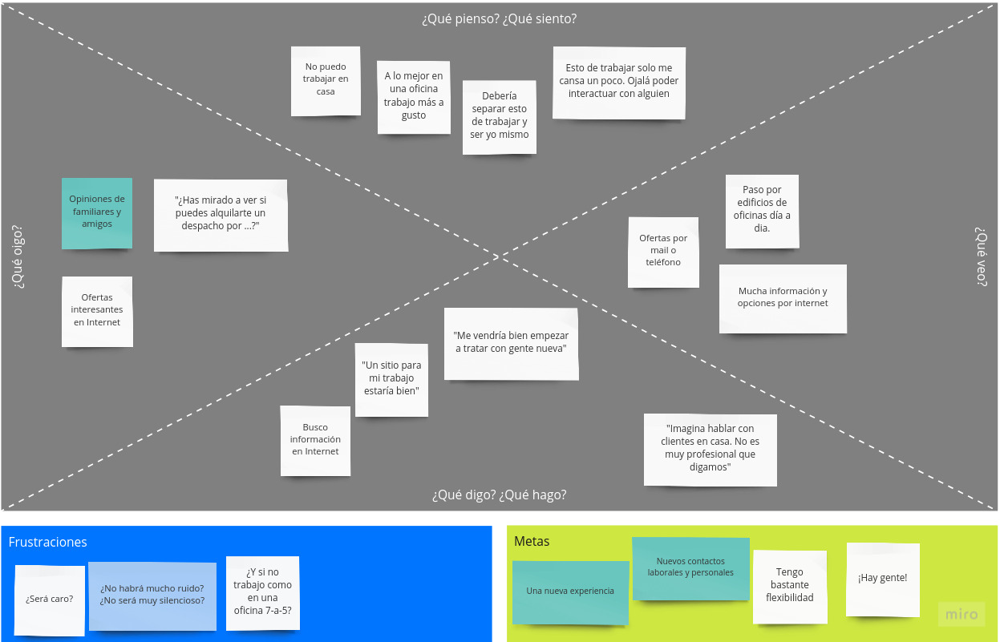
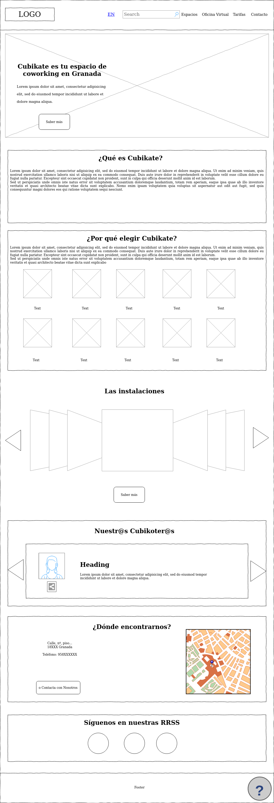
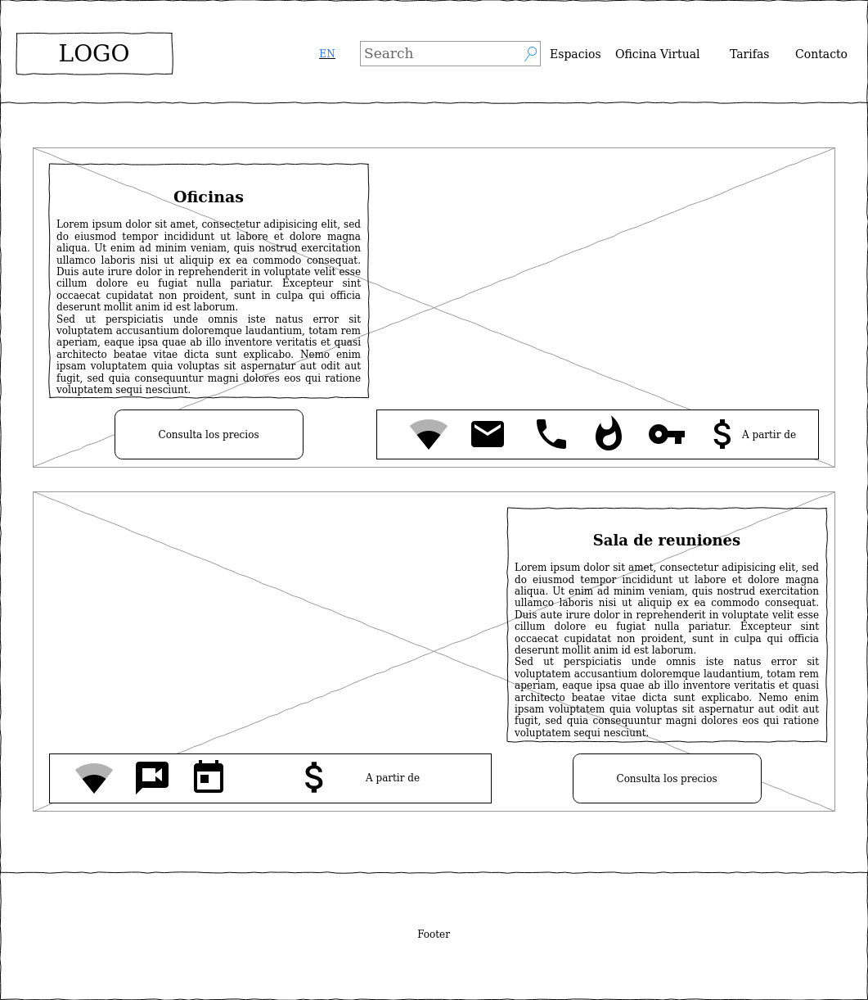
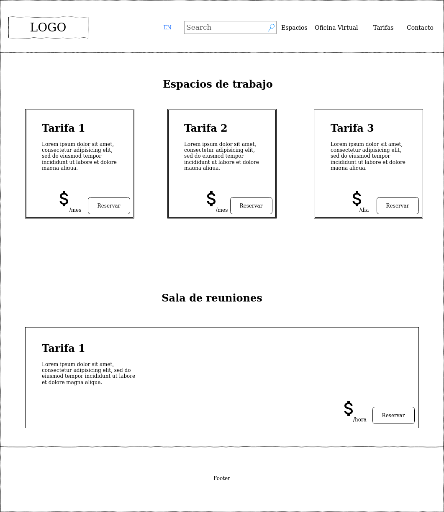
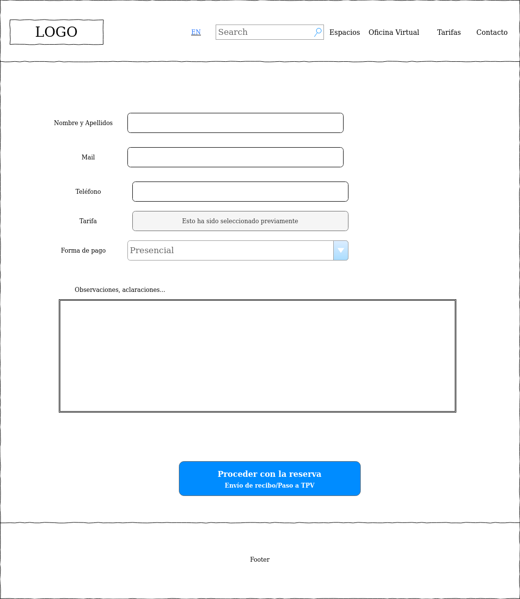
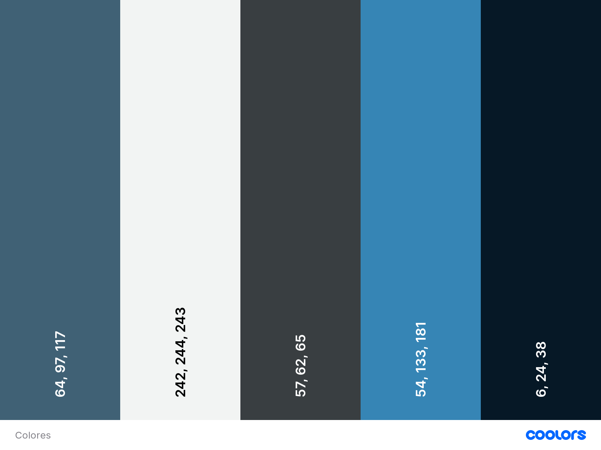
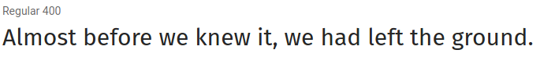
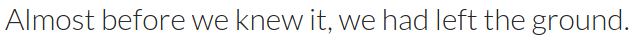

# DIU_Coworking-ReDesignProject
Ejercicio final de Diseño de Interfaces de Usuario de la Universidad de Granada (UGR) donde se hará una propuesta de valor de un espacio de CoWorking de la ciudad.

:bust_in_silhouette: Repositorio creado por Iván Valero Rodríguez (:octocat: [@IvanitiX en Github]())

## 0. Entrando en situación. ¿Qué es el Coworking?
---
Atendiendo a las definiciones que se frecuentan por la red de redes, un *espacio de coworking* es una oficina compartida por varias empresas, autónomos, teletrabajadores y empresarios que para realizar su trabajo no necesitan más que un ordenador portátil, una mesa, una silla y una buena conexión a Internet. 
Tal vez quien esté leyendo este repositorio diga *"Pero para eso podría hacerlo en la comodidad de mi casa..."* Pero hay cosas que no podrías lograr en casa y sí en un entorno como una oficina, y esa es la oportunidad de trabajar en un entorno laboral con la flexibilidad que uno pueda tener. Además eso aumentaría la red de contactos laborales y empresariales que uno tiene, cosa que los gestores de estos espacios frecuentan hacer y propiciar.
Como todo, tiene sus inconvenientes, como la pérdida de privacidad empresarial (estás compartiendo oficina con otras empresas) y que la oficina puede estar con mucho ruido o con un silencio sepulcral.
Para más información sobre el tema, adjunto algunas fuentes:

[Noticia de El Diario](https://www.eldiario.es/turing/coworking-ventajas-desventajas_0_208929234.html)

[Algunos casos sonados de éxito surgidos en *espacios de coworking*](https://coworkingspain.es/magazine/noticias/por-que-uber-nacio-en-un-coworking)

[Una página que recopila los espacios de *coworking* en España](https://coworkingspain.es/)

## 1. Análisis competitivo. ¿Cómo es el *Coworking* en Granada?
---
Al consultar la página de [CoworkingSpain](https://coworkingspain.es/), podemos ver un montón de oficinas registradas (y puede que haya alguna más que no esté registrada).
Entre estas, he decidido analizar las webs de tres empresas de este ámbito: *erranT*, *Anda* y *CubiKate*. Con ello trataremos de sacar partes comunes y diferencias dignas de mención por mi parte.

|Items a analizar/Empresas|*erranT*|*Anda*|*CubiKate*|
|-------------------------|---------|------|----------|
|Formato|Web|Web|Web
|Adaptación del contenido (responsive)|:heavy_check_mark:|:heavy_check_mark:|:heavy_check_mark:
|Otros idiomas|:heavy_check_mark: Inglés |:heavy_check_mark: Inglés|:x:
|Explicación del servicio|:heavy_check_mark:|:heavy_check_mark:|:heavy_check_mark:
|Servicios|:heavy_check_mark:|:heavy_check_mark:|:heavy_check_mark:|
|Fotos del lugar|:heavy_check_mark:|:heavy_check_mark:|:heavy_check_mark:
|Vista 360º del lugar|:heavy_check_mark:|:x:|:x:
|Recomendaciones de comunidad|:heavy_check_mark:|:heavy_check_mark:|:heavy_check_mark:
|Mapa del lugar y dirección|:heavy_check_mark:|:heavy_check_mark:|:heavy_check_mark:
|Formulario de contacto|:heavy_check_mark:|:heavy_check_mark:|:heavy_check_mark:
|Expositor de RRSS|:heavy_check_mark:|:heavy_check_mark:|:heavy_check_mark:
|Casos de éxito|:heavy_check_mark:|:heavy_check_mark:|:heavy_check_mark:
|-> Info sobre casos|:heavy_check_mark:|:heavy_check_mark:|:x:
|Tarifas en pantalla|:heavy_check_mark:|:heavy_check_mark:|:x:(No dicen precios,  hay que rellenar  formulario)
|Eventos del espacio|:x:|:heavy_check_mark:|:x:
|Alquiler de Sala|:heavy_check_mark:|:heavy_check_mark:|:heavy_check_mark:(No dicen precios,  hay que rellenar  formulario)
|Oficina virtual|:x:|:heavy_check_mark:|:heavy_check_mark:
|Búsqueda en página|:heavy_check_mark:|:x:|:x:|
|Chat online|:x:|:x:|:heavy_check_mark:
|Blog|:heavy_check_mark:|:heavy_check_mark:|:x:
|Contratación de servicio online|--|Sólo via formulario|--

En general , las empresas mencionadas tienen un esquema genérico. En una primera plana explican el concepto de *coworking*, los servicios que ofrecen, y algo que diferencie a los demás (como los casos de éxito , las referencias en medios de prensa tradicional y digital o servicios extra como una sección de comunicación visual). Una cosa que me ha llamado la atención es el chat de ayuda online de *CubiKate* y que no se pueda reservar una oficina o salón de eventos online, o al menos un pequeño formulario específico para ello.

A partir de aquí tenemos que centrarnos en una de las tres webs para enfocar el proyecto. En mi caso, elegiré *Cubikate* ya que está bastante completo y puede que con unas cuantas decisiones más de diseño y funcionalidad podría mejorarse más.

## 2. Mapa de empatía, Personas y Journey Maps. ¿Qué opinan los usuarios?
---

### 2.1 Empathy Map
Antes de nada, he empezado en pensar en ideas relacionadas con este concepto y los he clasificado, de forma que se pudieran representar en un Empathy Map

Aquí podemos destacar que la idea de esto al final es *"Quiero un sitio para trabajar que no sea en casa, pero temo tener que alquilar una oficina o despacho para mí con lo que cuesta, y no usarlo siempre"*. Puede haber algunas frustaciones y metas que se corresponderían con las ventajas y desventajas que se han comentado al inicio.

### 2.2 Personas
A partir de aquí podemos proceder a crear unas personalidades que den puntos de vista diferentes.

*Arcadia*: En esta persona podemos ver que es una nómada, alguien que no tiene una estabilidad debido a sus viajes pero de vez en cuando necesita un sitio para hacer su trabajo fuera de casa.

*Juan*: Esta persona es alguien asentado en la ciudad que trabaja desde remoto en una pequeña empresa y necesitaría un sitio fijo pero no es que gane lo suficiente para tener despacho propio.

### 2.3 Journey Map
Para este suceso, Arcadia estará en Granada unos días, de los cuales invertirá 2 en gestionar sus gestiones empresariales, y para ello quiere un espacio fuera de su hotel.

## 3. Informe de usabilidad
---

Vayamos punto por punto.

#### Funcionalidad
En general, las características y la funcionalidad cumplen con las metas comunes al usuario y con compatibles con los workflows de los usuarios. Sin embargo, no hay atajos para expertos, pero no es muy importante, pues no hay muchos subniveles y no es una página con una parte específica de usuarios.
#### Homepage
La página de inicio es un reflejo de la empresa. Los contenidos que se muestran son claros y llaman a la acción de la gente desde el minuto 1.

El diseño de la página es bastante claro, con un espacio en blanco justito. Una cosa que me llama la atención es un pequeño carrousel que muestra miniaturas de imágenes de la oficina
#### Navegación
Al ser una palabra que no se recurre, es fácil encontrarlo en las principales páginas de búsqueda.

La navegación es clara, con enlaces descriptivos, y se puede usar las funciones estándar del navegador. Eso sí, al navegar por la página vi que el HomePage y la pestaña Coworking son casi iguales.
#### Búsqueda
No hay una función de búsqueda, lo que podría ser interesante en un rediseño.
#### Control y feedback
La página es rápida en la respuesta. No puedo hablar de elementos de contral ya que no hay items o procedimientos dentro de la web (es una web de información, y apenas tiene un formulario de contacto)
#### Formularios
Solo hay un formulario de contacto, recurrido para todo lo necesario. Para los campos requeridos lo señala con `*`. La información que requieren es mínima y relevante
#### Errores
Los errores son descriptivos y se sitúan en las zonas donde están los errores. Guardan la info del formulario para poder corregirlo.
#### Contenido y texto
El contenido es fácil de entender, con un tono apropiado. Sin embargo, no he visto una versión inglesa o al menos en otro idioma, cosa que en el análisis competitivo vimos que sus competidores sí tenian. El texto es legible, y se puede escanear e imprimir sin problemas.
#### Ayuda
Una cosa que es muy relevante de esta página es su centro de ayuda, de hecho es muy similar al de Whatsapp, haciendo así una metáfora que sea fácil de entender y usar.
#### Rendimiento
En general, el rendimiento ayuda a que la experiencia de usuario sea buena, sin inhibirse por los errores que puedan suceder.

## 4. Feedback capture grid y Propuesta de Valor. ¿Qué podemos mejorar?
---
### 4.1 Matriz de captura de feedback
|Lo interesante|Críticas|
|-|-|
|Chat de ayuda|No hay función de búsqueda|
|Errores descriptivos|Solo un formulario para todo|
|No hay versión   en otro idioma| Muchas fotos algo desordenadas|

|Preguntas a partir de la experiencia|Nuevas ideas|
|-|-|
|Quiero saber más información sobre   esas empresas que promocionas,   ¿dónde puedo verlo?|Reserva online|
|¿Qué servicios hay en la sala  de reuniones?|Poner un horario|
|¿No es parecido el Homepage y la   sección Coworking?|Añadir las tarifas|

### 4.2 Propuesta de valor

Mi propuesta sería solo una serie de modificaciones sobre la base que ya estaba bastante bien de por sí.
>
>- Unir el homepage y la sección Coworking en el homepage.
>- Añadir las tarifas en una nueva sección
>- Poner varios formularios para algunos casos, y no usar un único. Por ejemplo, uno para contacto de información, y otros para hacer las reservas (de espacios de trabajos o de salas de reuniones) online.
>- Añadir una versión en inglés (y/u otros idiomas). Eso implicaría crear nuevos labellings.
>- Añadir una función de búsqueda para efectuar preguntas. Por ejemplo, *"¿Cuánto vale alquilar la sala de reuniones?"*.
>- Añadir una sección de Tarifas. 
>- Añadir una galería de imágenes, quizás tipo carrousel.
>- Añadir el horario del espacio.

## 5. Sitemap y Labelling. La estructura del diseño.
---
### 5.1 Sitemap
Una vez vista la propuesta de valor, procedemos a ver el flujo del sitio, sin entrar en cómo entrarán, cosa que se verá en siguientes pasos.

### 5.2 Labelling
|Español|English|Significado|
|-------|-------|-----------|
|Inicio|Homepage| Página de inicio de la web|
|Espacios| Facilities| Página donde se habla de las salas de reuniones   y de los espacios de trabajo.
|Oficina Virtual|Virtual Office| Página específica sobre el servicio de Oficina Virtual|
|Tarifas|Tariffs|Muestra las tarifas por los espacios de la empresa|
|Reserva|Reserve| En esta sección se rellena la información para efectuar la reserva online. Si hubiera que hacer pagos, quedaría en disposición de la empresa cómo hacerlo, quizás por TPV, PayPal y Pago presencial.
|Contacto|Contact us| Formulario de contacto para consultas varias (que no sean reservas) 

## 6. Wireframes. Un esbozo del rediseño.
---
#### Página de inicio

#### Página de espacios

#### Página de tarifas

#### Página de reserva

## 7. Guidelines. Colores, letras y normas de estilo.
---
Para las guidelines seguiremos las tendencias que se dan últimamente. La idea es que la homepage logre captar la atención del usuario, y las demás páginas son ya para complementar y seguir un hilo conductor. Como es una web, el diseño debería ser resonsivo y con una consistencia en cuestiones de diseño. La información debería ser clara y concisa, enfatizando lo más importante, manteniendo así un diseño simple.

Así pues, dejo en la siguiente infografía una serie de tipografías y colores, dejando en medida de lo posible lo que ya estaba hecho. Por tanto, mantendremos el logo, la iconografía (con color cambiado) y el azul #406175.

#### Colores

#### Tipografías
**Títulos: *Fira Sans*** 

**Contenido: *Lato*** 

